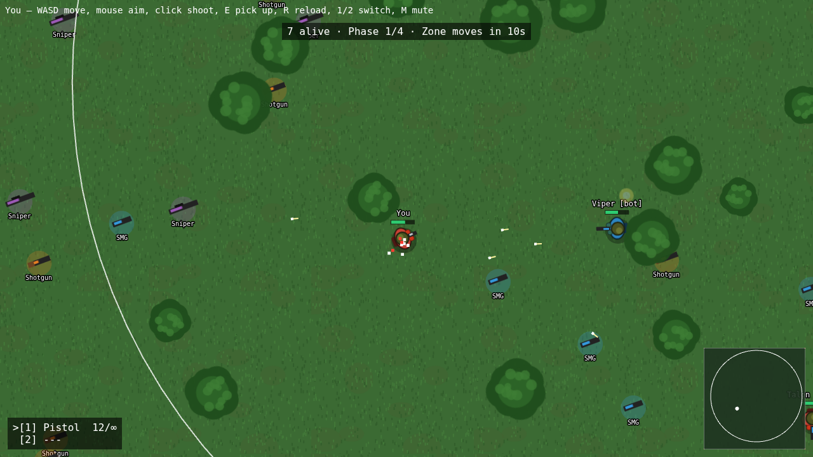
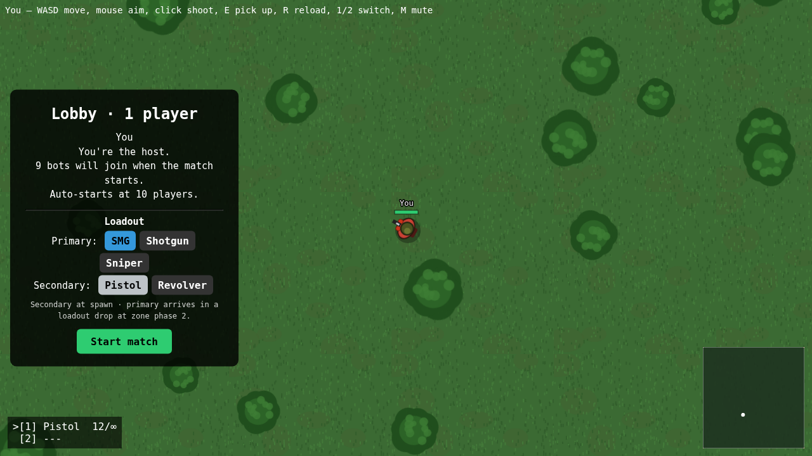
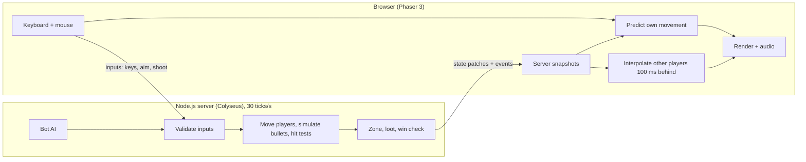

# Last Circle

**A battle royale that runs in your browser. Drop in, loot a gun, stay ahead of the closing zone, and be the last one standing.**

No download and no account: open the link and play. Bring your friends into the same match, or play alone against bots that fill the lobby.

**▶ Play now:** `https://YOUR-APP.onrender.com` *(replace after deploying; see [Deploy](#deploy))*



---

## What makes it interesting

- **Real-time multiplayer.** The server is authoritative, so a modified browser can't fire faster, reload instantly, or pick up loot from across the map. Your own movement is predicted locally and corrected by the server, so controls feel instant even with lag.
- **Never an empty lobby.** Server-side bots fill every match up to 10 players. They loot, flee the zone, and fight with human-like reaction time and aim error, and they only engage within about half a screen, so they don't snipe you from off-screen.
- **A Warzone-style loadout drop.** Pick your guns in the lobby. You start with your sidearm and loot like everyone else, and mid-match a crate only you can open lands next to you with your primary.
- **Zero asset files.** Every sprite and sound is generated in code when the game starts. The whole game is about 1,850 lines of JavaScript and a 368 KB download (gzipped).
- **Positional audio.** Footsteps and gunshots get louder as they get closer and pan left or right, so you can hear a fight before you see it.

## How a match plays

| Stage | What happens |
|---|---|
| **Lobby** | Walk around, pick your loadout. The first player in is host and presses **Start** (it auto-starts when the room is full at 20). |
| **Drop** | 3-second countdown. Bots fill the empty slots, and everyone lands spread out across the map. |
| **Loot** | Grab an SMG, shotgun or sniper off the ground. Bushes hide you from other players (bots aren't fooled). |
| **Zone** | Four phases. The safe circle shrinks towards a random spot, and the gas hurts more each phase (2 → 5 → 10 → 20 HP/s). |
| **Loadout drop** | At phase 2, your personal crate lands next to you with your chosen primary. |
| **Endgame** | No respawns. Eliminated players spectate their killer, the last one alive wins, and everyone returns to the lobby. |



## Controls

| Key | Action |
|---|---|
| **W A S D** | Move |
| **Mouse** | Aim |
| **Left click** (hold) | Shoot |
| **E** | Pick up / swap weapon, open your loadout crate |
| **R** | Reload |
| **1 / 2** | Secondary / primary |
| **M** | Mute |

## Weapons

| Weapon | Kills a full-health player in | Role |
|---|---|---|
| Pistol | 5 hits (1.2 s) | Default sidearm, unlimited spare ammo |
| Revolver | 3 hits (1.1 s) | Accurate sidearm, 6 rounds |
| SMG | 10 hits (0.9 s) | Forgiving at mid range |
| Shotgun | 1 shot at point blank | Close range only |
| Sniper | 1 hit | Rare, 4 per magazine, slow |

## How it works



- **Server-authoritative.** Clients only send intentions (keys held, aim angle, "shoot", "pick up"). The server decides every result: position, damage, ammo, and who won.
- **Checks the server enforces:** movement can't exceed real elapsed time, and fire rate, magazine, reload state, pickup range, loadout choices, crate ownership and the host-only Start button are all validated.
- **Prediction and reconciliation.** Your client moves you immediately, and each server update carries the last input it applied. The client snaps to the server's position and replays the inputs the server hasn't processed yet, so your movement stays smooth.
- **Bullets exist only on the server.** Clients receive "fired" and "ended" events and draw tracers. Hits are checked along the whole path a bullet travelled each tick, so fast sniper rounds can't pass through players.
- **Bots use the same rules.** Bot AI calls the same shoot, reload and pickup code as human input, so it can't cheat either.

## Tech stack

| Part | Choice |
|---|---|
| Client | [Phaser 3](https://phaser.io) and Vite |
| Multiplayer | [Colyseus 0.18](https://colyseus.io) (rooms, state sync) on Node.js 22 |
| Art | Drawn in code at startup (`client/src/art.js`) |
| Audio | Synthesized with the Web Audio API (`client/src/sfx.js`) |
| Hosting | One Render web service serves both the game page and the WebSocket server |
| Built with | [Claude Code](https://claude.ai/code) as an AI pair programmer |

## What's next

- **Lag compensation:** rewind hit boxes to what the shooter saw, so leading targets isn't needed on high ping.
- **Cover:** walls and rocks that block movement and bullets.
- **Squads:** duos and quads with revives.
- **Touch controls:** the game is desktop-only today.

---

## Run locally

```bash
cd battle-royale
npm run install:all
npm run dev:server   # terminal 1: game server on :2567
npm run dev:client   # terminal 2: open the URL Vite prints
```

Open two tabs to see two players, and add `?name=Alice` to the URL to set a name. Phones and laptops on the same Wi-Fi can join through the "Network" URL Vite prints (keyboard and mouse needed).

## Deploy

`render.yaml` in the repository root is a Render Blueprint:

1. Push this repo to GitHub.
2. On [render.com](https://render.com): **New → Blueprint**, then pick the repo.
3. Click **Apply**. After a few minutes you get a public URL.

It runs as a single free web service (`npm run build`, then `npm start`), with `/health` for Render's health check. On the free plan the service sleeps after 15 minutes idle, and the first visit after that takes about a minute to wake it.

## Configuration

| Setting | Where | Default | Effect |
|---|---|---|---|
| `BOTS` | env var | `10` | Bots fill each match up to this many players (`0` = off) |
| `ZONE_TIME_SCALE` | env var | `1` | Speeds up the zone. `1` ≈ 4-minute match, `3` ≈ 80 seconds |
| `PORT` | env var | `2567` | Server port |
| `LOADOUT_DROP_PHASE` | `server/src/constants.js` | `2` | Zone phase when loadout crates land (`0` = spawn with full loadout) |
| `MIN_PLAYERS`, `AUTO_START_PLAYERS` | `server/src/constants.js` | `2`, `20` | Lobby start rules |
| Weapon stats | `server/src/weapons.js` | | Damage, fire rate, spread, pellets, magazine, reload, loot rarity |
| Zone phases | `server/src/zone.js` | | Wait and shrink times, circle sizes, damage per phase |
| Bot behaviour | top of `server/src/bots.js` | | Sight range, reaction time, aim error |

## Project structure

```
battle-royale/
├── server/src/
│   ├── index.js       HTTP + WebSocket server, serves the built client
│   ├── GameRoom.js    match flow, inputs, bullets, damage, loot, loadouts
│   ├── bots.js        bot AI
│   ├── zone.js        shrinking zone
│   ├── weapons.js     weapon stats (shared with the client)
│   ├── constants.js   shared movement code and match settings
│   └── schema.js      synced state definitions
├── client/src/
│   ├── main.js        game scene: prediction, interpolation, UI
│   ├── art.js         procedural textures
│   └── sfx.js         procedural sound effects
└── docs/              screenshots
```
